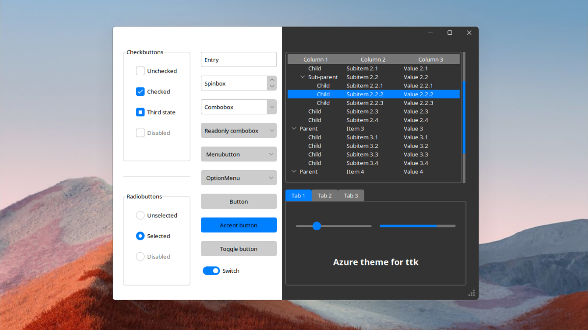

# Temas Azure para ttk



## Como usar?
Assim como no meu tema Sun Valley na versão 2.0, eu queria tornar o uso do tema muito simples, então a configuração do tema é tratada por um script tcl separado.
Dessa forma, seja você querendo usar um tema escuro ou claro, você só precisa importar um único arquivo. Outra coisa que torna essa uma boa solução é que normalmente a troca entre temas claro e escuro não é totalmente perfeita, e as cores não estão corretas.

```python
#Simplesmente importe o arquivo azure.tcl.
widget.tk.call("source", "azure.tcl")

# Em seguida, defina o tema desejado com o procedimento set_theme.
widget.tk.call("set_theme", "light")
# ou
widget.tk.call("set_theme", "dark")
```

### Mudar de temas
Geralmente não é tão simples, porque as cores podem ficar incorretas. No entanto, com a solução atual, você pode mudar o tema a qualquer momento sem problemas de cores.

```python
import tkinter as tk
from tkinter import ttk

root = tk.Tk()

# Empacote um grande frame para que ele se comporte como o plano de fundo da janela.
big_frame = ttk.Frame(root)
big_frame.pack(fill="both", expand=True)

# Defina o tema inicial.
root.tk.call("source", "azure.tcl")
root.tk.call("set_theme", "light")

def change_theme():
    # NOTA: O nome real do tema é azure-<modo>
    if root.tk.call("ttk::style", "theme", "use") == "azure-dark":
        # Defina o tema claro
        root.tk.call("set_theme", "light")
    else:
        # Defina o tema escuro
        root.tk.call("set_theme", "dark")

# Lembre-se, você precisa usar widgets ttk
button = ttk.Button(big_frame, text="Mudar o tema!", command=change_theme)
button.pack()

root.mainloop()
```

## Novos elementos de estilo

O tema Azure possui um estilo para cada widget ttk, mas existem alguns novos estilos de widgets, como um botão de destaque, interruptor de alternância, botão de alternância, escala de marcas e cartão. Você pode aplicar esses estilos usando o parâmetro "style".


Se você precisar de um botão destacado, use: `Accent.TButton`:
```python
accent_button = ttk.Button(root, text='Accent button', style='Accent.TButton', command=callback)
```

Para criar um botão de alternância, você precisa de um botão de seleção ao qual pode aplicar o `Toggle.TButton` style:
```python
toggle_button = ttk.Checkbutton(root, text='Toggle button', style='Toggle.TButton', variable=var)
```


O uso de interruptores em vez de caixas de seleção está se tornando mais comum nos dias de hoje, por isso este tema possui um estilo chamado "Switch.TCheckbutton" que você pode aplicar aos seus botões de seleção para obter um visual de interruptor. `Switch.TCheckbutton` um estilo que pode ser aplicado aos botões de seleção para obtê-los no estilo de interruptor.:
```python
switch = ttk.Checkbutton(root, text='Switch', style='Switch.TCheckbutton', variable=var)
```

Se você não gosta do grande círculo na escala e prefere algo mais sólido, então use o estilo Switch.TScale. `Tick.TScale` style:
```python
tick_scale = ttk.Scale(root, style='Tick.TScale', variable=var)
```


Se você deseja apenas uma borda ao redor de seus widgets e não um LabelFrame inteiro, aplique o estilo `Card.TFrame` a um Frame.:
```python
card = ttk.Frame(root, style='Card.TFrame', padding=(5, 6, 7, 8))
```

## Bugs
- 
- Tk não é realmente bom em exibir imagens png, então se o seu programa está lento com o tema, por favor, confira o [gif-based branch!](https://github.com/rdbende/Azure-ttk-theme/tree/gif-based/)
- 
-Se o seu aplicativo tiver um widget treeview e você alterar o tema, a janela se expandirá horizontalmente. Este é um bug estranho que se aplica a todos os temas ttk. 


Se você chegou até aqui, por favor, dê uma olhada nos meus outros temas!
- [](https://github.com/rdbende/Sun-Valley-ttk-theme) Um tema que se parece com o Windows 11!
- [](https://github.com/rdbende/Forest-ttk-theme) Um tema inspirado no visual do Excel.
